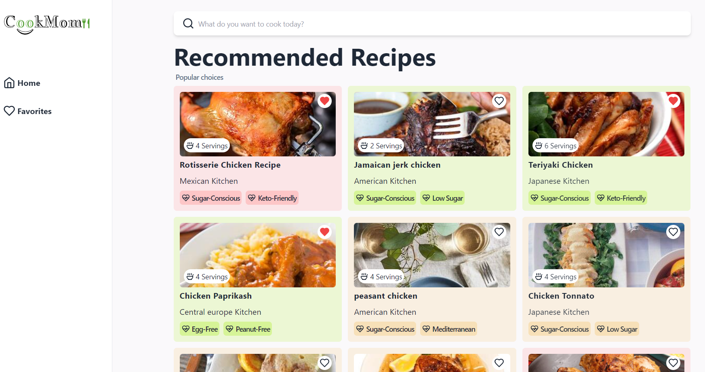

# Recipe Finder App



Welcome to the Recipe Finder App! This project is built using *React* and *TailwindCSS* and leverages the *EDAMAM API* to fetch delicious recipes.

## 🌟 Features

- *React* for building the user interface
- *TailwindCSS* for styling
- *Responsive Design* to look great on all devices
- *EDAMAM API* integration for fetching recipes
- *Favorites* feature to save your favorite recipes

## 🚀 Getting Started

Follow these instructions to get a copy of the project up and running on your local machine.

### Prerequisites

Make sure you have the following installed:

- [Node.js](https://nodejs.org/)
- [npm](https://www.npmjs.com/)

### Setup .env file

Create a .env file in the root directory and add your EDAMAM API credentials:

```env
VITE_APP_ID=your_edamam_app_id
VITE_APP_KEY=your_edamam_app_key
